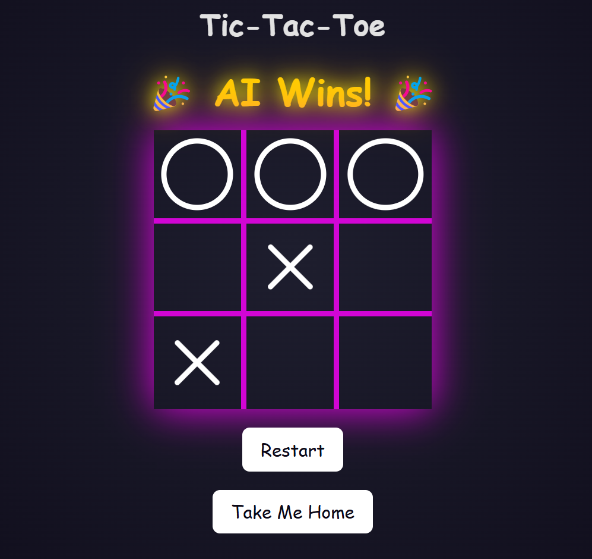

<div align="center">

# Qoraal Tic-Tac-Toe

<div align="left">


### &nbsp;&nbsp;&nbsp;&nbsp;&nbsp;&nbsp;&nbsp;&nbsp;&nbsp;&nbsp;&nbsp;This is what it all was for

<div align="center">

#### __You finally arrived.__

##### I was beginning to wonder if you would.  
It’s a pleasure to finally make your acquaintance.&nbsp;&nbsp;&nbsp;&nbsp;&nbsp;&nbsp;&nbsp;&nbsp;&nbsp;&nbsp;&nbsp;&nbsp;&nbsp;&nbsp;&nbsp;

</div>

<div align="right">

#### Here, let me take that off your hands. &nbsp;&nbsp;&nbsp;&nbsp;&nbsp;&nbsp;&nbsp;&nbsp;&nbsp;&nbsp;&nbsp;&nbsp;&nbsp;&nbsp;&nbsp;&nbsp;&nbsp;&nbsp;&nbsp;&nbsp;&nbsp;&nbsp;&nbsp;&nbsp;&nbsp;&nbsp;&nbsp;&nbsp;&nbsp;&nbsp;&nbsp;&nbsp;&nbsp;&nbsp;&nbsp;&nbsp;&nbsp;

</div>

&nbsp;&nbsp;&nbsp;&nbsp;&nbsp;&nbsp; Third door on the left... if you dare.

<div align="center">


### Follow me...&nbsp;&nbsp;&nbsp;&nbsp;&nbsp;&nbsp;&nbsp;&nbsp;&nbsp;&nbsp;&nbsp;&nbsp;&nbsp;&nbsp;&nbsp;

<br>

</div>

<div align="center">
  
</div>
<br>
<div align="center">
first, let me show you this
<br>
<br>
<div align="left">


```cpp
decl_name       "tic-tac-toe"
decl_version    1


decl_events {
    _tictac_tick
    _tictac_restart
}


statemachine tictactoe {

    startstate ready

    state ready {
        /*
         * Entering the ready state we signal that we are ready (html_ready) to render 
         * html should we receive the _html_render event.
         */
        enter (html_ready)
        action (_tictac_restart, tictac_restart)
        action (_tictac_tick, tictac_play, [e])
        event (_html_render, html_head)
        /*
         * On exit, begin a "text/html" response. All subsequent html_emit calls will 
         * add to the response content.
         */
        exit (html_response, HTML)

    }

    state html {
        enter (html_emit,       "<!DOCTYPE html>\r\n"
                                "<html lang=\"en\">\r\n")
        /*
         * When we exit the html super state, to return to the "ready" state again, we 
         * close the HTML document by emitting the closing </html> tag.
         */
        exit (html_emit,        "</html>\r\n")

    }

    super html {
        state html_head {
            /*
             * Engine machine language commands are single-line. However, multi-line text blocks are allowed.
             * Ensure the closing bracket is on the same line as the final line of text.
             */
            enter (html_emit,   "<head>\r\n"
                                "<meta charset=\"UTF-8\">\r\n"
                                "<meta name=\"viewport\" content=\"width=device-width, initial-scale=1.0\">\r\n"
                                "<title>Tic-Tac-Toe</title>\r\n"
                                "<link rel=\"stylesheet\" href=\"/engine/tictaccss\">\r\n")
            event (_state_start, html_board_title)
            exit (html_emit,    "</head>\r\n")

        }
        
    }

    super html {
        /*
         * States can be nested. You can either nest them directly or repeat the "super" identifier.
         */
        state html_body {
            enter (html_emit,   "<body>\r\n")
            /*
             * Use html_subst_emit to perform token substitution on identifiers in square brackets ([]).
             * Escape brackets if you don’t intend to substitute.
             */
            exit (html_subst_emit,    "<button class=\"restart-btn\" onclick=\"window.location.href='/engine/tictactoe/[_tictac_restart]'\">Restart</button>\r\n"
                                "<button class=\"restart-btn\" onclick=\"window.location.href='/index'\">Take Me Home</button>"
                                "</body>")

        }

        super html_body {

            state html_board_title {
                action (_state_start, html_emit,                        "<h1>Tic-Tac-Toe</h1>\r\n")
                action_ld (_state_start, [a], tictac_status)
                action_eq (_state_start, TICTAC_DRAW,       html_emit,  "<div id=\"winner-message\" class=\"winner\"> Draw </div>\r\n\r\n")
                action_eq (_state_start, TICTAC_PLAYER_WIN, html_emit,  "<div id=\"winner-message\" class=\"winner\"> 👑 Player Wins! 👑 </div>\r\n")
                action_eq (_state_start, TICTAC_AI_WIN,     html_emit,  "<div id=\"winner-message\" class=\"winner\"> 🎉 AI Wins! 🎉 </div>\r\n")
                event (_state_start, html_board_cell)

            }
           
            state html_board {
                /*
                 * Reset the register [r], used a cell counter, to zero before rendering the board.
                 */
                enter (r_load, 0)
                enter (html_emit,   "<div class=\"board\">\r\n")
                exit (html_emit,    "</div>\r\n")

            }

            super html_board {

                state html_board_cell {
                    action_ld (_state_start, [a], tictac_cell, [r])
                    /*
                     * If the cell is still open, create a clickable link that triggers a _tictac_tick event.
                     * The cell number is passed in the event register [e].
                     */
                    action_eq (_state_start, TICTAC_OPEN,   html_subst_emit,"<div class=\"cell\">"
                                                                            "<a href=\"/engine/tictactoe/[_tictac_tick]/[r]\" "
                                                                            "class=\"invisible-link\"></a></div>\r\n")
                    action_eq (_state_start, TICTAC_PLAYER,     html_emit,  "<div class=\"cell x\"></div>\r\n")
                    action_eq (_state_start, TICTAC_AI,         html_emit,  "<div class=\"cell o\"></div>\r\n")
                    action_eq (_state_start, TICTAC_PLAYER_BLINK,   html_emit,  "<div class=\"cell x blink\"></div>\r\n")
                    action_eq (_state_start, TICTAC_AI_BLINK,       html_emit,  "<div class=\"cell o blink\"></div>\r\n")
                    /*
                     * After processing a cell, the register [r] increments until it reaches 9.
                     * Once [r] hits 9, the [a] accumulator is set, and we return to the "ready" state (event_if).
                     * Otherwise, we continue rendering the next cell (event_nt).
                     */
                    action (_state_start, r_inc, 9)
                    event_nt (_state_start, html_board_cell)
                    event_if (_state_start, ready)

                }

            }     

        }

    }

}
```
<br>

### Lets get into it
At its core, a hierarchical state machine is a powerful tool for structuring logic in a modular, maintainable way. When you use it to render structured text like HTML, you unlock an elegant, flexible method for building dynamic web applications. 
The __Qoraal Engine__ framework leverages this concept brilliantly—by mapping state transitions to HTML rendering, it turns what could be a tangle of code into a clear, hierarchical process. This not only keeps your code neat and scalable but also makes development fun, as every state tells a part of your application's story.

__Engine__ goes even further by integrating backend logic, as demonstrated in the tic-tac-toe example. Functions `tictac_play`, `tictac_status`, and `tictac_cell` connect with the AI game backend, handling moves, checking game status, while `html_ready`, `html_response` and `html_emit` update the board rendering. The beauty of __Engine__ is in how it unifies these components: the state machine manages the HTML output and user interactions, while the backend logic processes the game mechanics, resulting in a cohesive and dynamic gaming experience.

On system startup, the Tic-Tac AI initializes with a model trained over 200,000 iterations. The initial model parameters were precomputed and stored to ensure immediate availability at launch.

:bulb: Tip: You can retrain your AI using the console command `tictactrain x`, where `x` is the number of iterations you want to train it for.

So dive in and experience how structured state machines can transform your approach to rendering, interactivity, and even game logic!

### Quick start
The demo application can be compiled using the POSIX port for evaluation. 
Currently supported RTOS options include ChibiOS, FreeRTOS, and ThreadX, if you have an IP stack like LwIP.

Since IP connectivity is required, you cannot run this in GitHub Codespaces.
To run it locally on Windows/Linux, follow these steps:

1. Open your development environment and checkout the repository.
2. Run the appropriate script based on your OS:
    - **Windows**: `> build_and_run.bat`
    - **Linux**: `$ sh ./build_and_run.sh`
3. When the application starts, a shell will open, displaying startup logs.
4. If building locally you can access the web interface at http://127.0.0.1:8080 (or use your build machine’s IP if running remotely).

That’s it. 🚀

