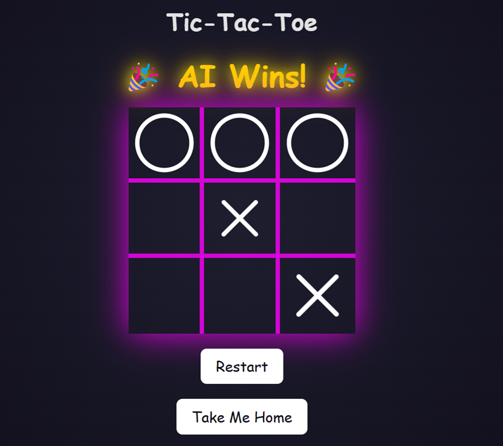

<div align="center">

# qoraal-tictactoe

<div align="left">


### &nbsp;&nbsp;&nbsp;&nbsp;&nbsp;&nbsp;&nbsp;&nbsp;&nbsp;&nbsp;&nbsp;This Is What It All Was For

<div align="center">

#### __You finally arrived.__

##### I was beginning to wonder if you would.  
It’s nice to make your acquaintance.&nbsp;&nbsp;&nbsp;&nbsp;&nbsp;&nbsp;&nbsp;&nbsp;&nbsp;&nbsp;&nbsp;&nbsp;&nbsp;&nbsp;&nbsp;

</div>

<div align="right">

#### Shall I take your coat?  &nbsp;&nbsp;&nbsp;&nbsp;&nbsp;&nbsp;&nbsp;&nbsp;&nbsp;&nbsp;&nbsp;&nbsp;&nbsp;&nbsp;&nbsp;&nbsp;&nbsp;&nbsp;&nbsp;&nbsp;&nbsp;&nbsp;&nbsp;&nbsp;&nbsp;&nbsp;&nbsp;&nbsp;&nbsp;&nbsp;&nbsp;&nbsp;&nbsp;&nbsp;&nbsp;&nbsp;&nbsp;

</div>

&nbsp;&nbsp;&nbsp;&nbsp;&nbsp;&nbsp; It’s just down the hall, to the right.

<div align="center">


### Follow me...&nbsp;&nbsp;&nbsp;&nbsp;&nbsp;&nbsp;&nbsp;&nbsp;&nbsp;&nbsp;&nbsp;&nbsp;&nbsp;&nbsp;&nbsp;

<br>

</div>

<div align="center">
  
</div>
<br>
<div align="center">
First, let me show you this:
<br>
<br>
<div align="left">

```
decl_name       "tic-tac-toe"
decl_version    1


decl_events {
    _tictac_tick
    _tictac_restart
}


statemachine tictactoe {

    startstate ready

    state ready {
        enter (html_ready)
        action (_tictac_restart, tictac_restart)
        action (_tictac_tick, tictac_play, [e])
        event (_html_render, html_head)
        exit (html_response, HTML)
    }

    state html {
        enter (html_emit,       "<!DOCTYPE html>\r\n"
                                "<html lang=\"en\">\r\n")
        exit (html_emit,        "</html>\r\n")
    }

    super html {
        state html_head {
            enter (html_emit,   "<head>\r\n"
                                "<meta charset=\"UTF-8\">\r\n"
                                "<meta name=\"viewport\" content=\"width=device-width, initial-scale=1.0\">\r\n"
                                "<title>Tic-Tac-Toe</title>\r\n"
                                "<link rel=\"stylesheet\" href=\"/engine/tictaccss\">\r\n")
            event (_state_start, html_board_title)
            exit (html_emit,    "</head>\r\n")
        }
        
    }

    super html {
        state html_body {
            enter (html_emit,   "<body>\r\n")
            exit (html_emit,    "<button class=\"restart-btn\" onclick=\"window.location.href='/engine/tictactoe/[_tictac_restart]'\">Restart</button>\r\n"
                                "<button class=\"restart-btn\" onclick=\"window.location.href='/index'\">Take Me Home</button>"
                                "</body>")

        }
        super html_body {

            state html_board_title {
                action (_state_start, html_emit,                        "<h1>Tic-Tac-Toe</h1>\r\n")
                action_ld (_state_start, [a], tictac_status)
                action_eq (_state_start, TICTAC_DRAW,       html_emit,  "<div id=\"winner-message\" class=\"winner\"> Draw </div>\r\n\r\n")
                action_eq (_state_start, TICTAC_PLAYER_WIN, html_emit,  "<div id=\"winner-message\" class=\"winner\"> 👑 Player Wins! 👑 </div>\r\n")
                action_eq (_state_start, TICTAC_AI_WIN,     html_emit,  "<div id=\"winner-message\" class=\"winner\"> 🎉 AI Wins! 🎉 </div>\r\n")
                event (_state_start, html_board_cell)

            }
           
            state html_board {
                enter (r_load, 0)
                enter (html_emit,   "<div class=\"board\">\r\n")
                exit (html_emit,    "</div>\r\n")

            }
            super html_board {

                state html_board_cell {
                    action_ld (_state_start, [a], tictac_cell, [r])
                    action_eq (_state_start, TICTAC_OPEN,   html_subst_emit,    "<div class=\"cell\"><a href=\"/engine/tictactoe/[_tictac_tick]/[r]\" class=\"invisible-link\"></a></div>\r\n")
                    action_eq (_state_start, TICTAC_PLAYER,         html_emit,  "<div class=\"cell x\"></div>\r\n")
                    action_eq (_state_start, TICTAC_AI,             html_emit,  "<div class=\"cell o\"></div>\r\n")
                    action_eq (_state_start, TICTAC_PLAYER_BLINK,   html_emit,  "<div class=\"cell x blink\"></div>\r\n")
                    action_eq (_state_start, TICTAC_AI_BLINK,       html_emit,  "<div class=\"cell o blink\"></div>\r\n")
                    action (_state_start, r_inc, 9)
                    event_nt (_state_start, html_board_cell)
                    event_if (_state_start, ready)

                }
            }            
        }
    }


}
```
